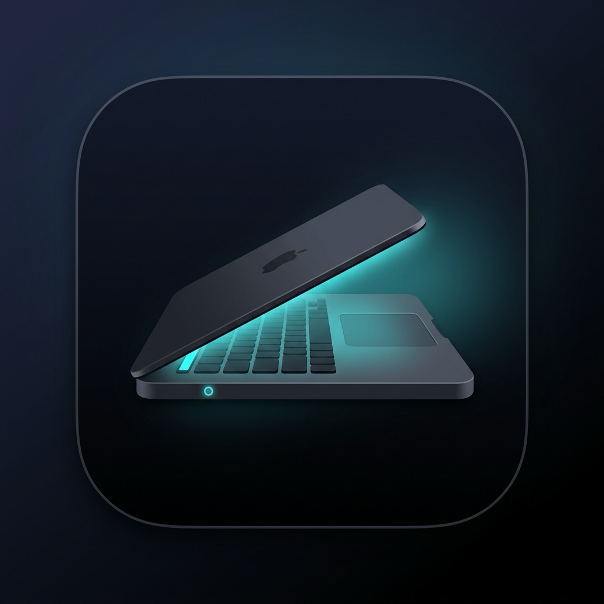

# LidClosed

<p align="center">
  
</p>

<p align="center">
  <strong>Keep your Mac awake with the lid closed.</strong>
</p>

<p align="center">
  A lightweight macOS menu bar utility that prevents your Mac from sleeping — with the lid closed, or just with it open.<br>
  Two switches, no bloat.
</p>

---

## What it does

LidClosed sits in your menu bar and offers two independent ways to stop your Mac from sleeping.

### 🔓 Lid Closed Mode

Your Mac keeps running **even when you close the lid** — perfect for:

- 🎵 Playing music through external speakers with the lid closed
- 📺 Using an external monitor in clamshell mode without a charger
- ⬇️ Keeping downloads running overnight
- 🖥️ Running servers or long tasks while the Mac is tucked away

### ☕ Keep Awake (Lid Open)

Keeps the display and system awake **as long as the lid stays open**. Nothing more — close the lid and the Mac sleeps normally.

Reach for this one when you do not actually need clamshell operation: it needs **no admin password**, changes **no system settings**, and stops the moment you switch it off or quit the app.

## How it works

| | Lid Closed Mode | Keep Awake |
|---|---|---|
| Mechanism | `pmset disablesleep 1` | `caffeinate -dimsu -w <pid>` |
| Keeps the system awake | ✅ | ✅ |
| Works with the lid closed | ✅ | ❌ |
| Keeps the **display** on | ❌ | ✅ |
| Admin password | required | not needed |
| Changes a system setting | yes, and it persists across reboots | no |
| If the app crashes | recovered on next launch | released automatically |

Disabling lid-closed mode, or quitting from the menu, prompts for your password again and restores normal sleep behavior. Keep Awake just stops.

The two are independent and neither one covers the other, so running both is a real combination rather than a redundant one: **system never sleeps *and* the display never blanks.**

Lid Closed Mode disables system sleep, but the `displaysleep` timer keeps running — your screen will still turn off on schedule. Only Keep Awake holds the display on. Turn on both if you are watching something on an external monitor and also want the lid to be closeable.

### Safety Features

- **State Tracking** — The app writes a state file to `~/Library/Application Support/LidClosed` when it activates the override, and only ever disables an override it knows it owns. If sleep was already disabled by something else, LidClosed leaves it alone.
- **Crash Recovery** — If the app crashes or is force-killed, the next launch detects the stale state file and offers to re-enable sleep. If a restore fails or you cancel the prompt, the state file is kept so recovery can be retried.
- **Single Instance** — Only one copy runs at a time. A second instance would see the first one's state file, mistake the live override for a leftover, and try to undo it.
- **Security** — The installation script installs the bundle with root ownership (`root:wheel`), so a process running as your user cannot swap the executable and inherit the root privileges the app requests. The bundle is also ad-hoc signed, which makes accidental corruption detectable — note that ad-hoc signatures are not a defence against a determined local attacker, since anyone can re-sign without a certificate.

> [!NOTE]
> This applies to **Lid Closed Mode only**. Logout and restart cannot be cleaned up automatically, because restoring sleep needs an admin password and there is nobody to type one at logout. If you log out while it is Active, sleep stays disabled until you launch LidClosed again — or run `sudo pmset disablesleep 0` yourself. **Keep Awake has no such problem** and releases itself whatever happens to the app.

## Installation

### Quick Install (Build + Install to /Applications)

```bash
git clone https://github.com/akwnnwastaken/LidClosed.git
cd LidClosed
./scripts/install.sh
```

This builds the app, creates a signed `.app` bundle with an icon, and securely installs it to `/Applications` (requires `sudo`). After installation, you can find it with **Spotlight** (Cmd+Space → "LidClosed").

### Manual Build

```bash
git clone https://github.com/akwnnwastaken/LidClosed.git
cd LidClosed
swift build -c release
```

The binary will be at `.build/release/LidClosed`.

## Usage

**Lid closed:**

1. Launch **LidClosed** — it appears as a laptop icon in your menu bar
2. Click the icon → **▶ Enable Lid Closed Mode**
3. Enter your admin password when prompted
4. Close your lid — your Mac stays awake! ☕
5. Click the icon → **⏹ Disable Lid Closed Mode** to return to normal behavior

**Lid open** — no password, nothing to undo:

1. Click the icon → **Keep Awake (Lid Open)**
2. A checkmark appears and the icon becomes a cup
3. Click it again to switch it off

### Menu Bar States

| Icon | Status line |
|------|-------------|
| 🔒💻 | ○ Inactive — normal sleep behavior |
| ☕ | ◐ Awake — but sleeps if you close the lid |
| 🔓💻 | ● Awake with the lid closed — display still sleeps |
| 🔓💻 | ● Awake with the lid closed — display stays on |
| 🔓💻 | ● Sleep disabled outside LidClosed — display still sleeps |
| 🔓💻 | ● Sleep disabled outside LidClosed — display stays on |

The status line always names both protections, because neither one implies the other. The icon reflects Lid Closed Mode when it is on, since that is the stronger of the two.

## Requirements

- macOS 13.0 (Ventura) or later
- Swift 5.9+
- Admin privileges — for Lid Closed Mode only; Keep Awake needs none

## Troubleshooting & Uninstallation

> [!WARNING]
> LidClosed modifies a **global system setting**. If you delete the app while it is Active, your Mac will never sleep again until you manually revert the setting.

**Always click "Disable Lid Closed Mode" before uninstalling the app.** (Keep Awake needs no such care — it leaves nothing behind.)

If you forgot, or if the app crashes and you don't want to launch it again, open Terminal and run:

```bash
sudo pmset disablesleep 0
```

To fully uninstall:
1. Ensure sleep is re-enabled (see above).
2. `sudo rm -rf /Applications/LidClosed.app`
3. `rm -rf ~/Library/Application Support/LidClosed`

## License

MIT License — see [LICENSE](LICENSE) for details.

---

<p align="center">
  Made with ☕ to keep your Mac awake.
</p>
